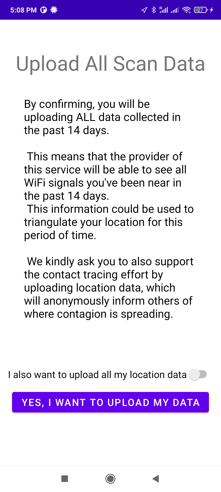
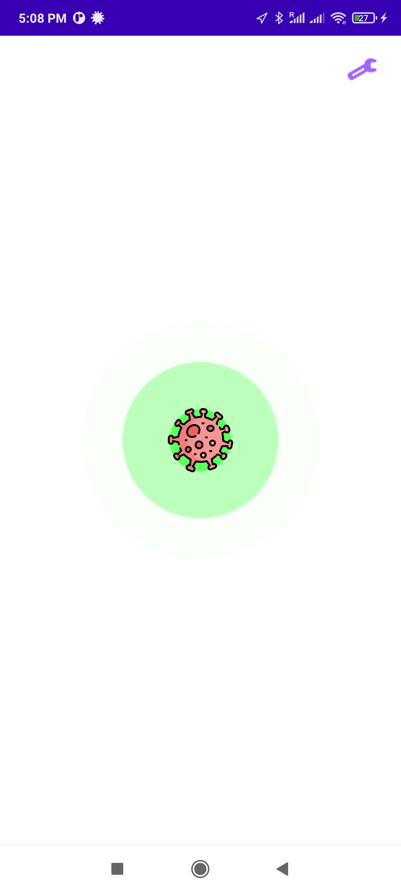

[![Contributors][contributors-shield]][contributors-url]
[![Forks][forks-shield]][forks-url]
[![Stargazers][stars-shield]][stars-url]
[![Issues][issues-shield]][issues-url]
[![MIT License][license-shield]][license-url]
[![LinkedIn][linkedin-shield]][linkedin-url]

<!-- PROJECT LOGO -->
 

  

  <h3 align="center">Android App</h3>

  

    WiFi-based contact tracing app, developed as part of <a href="https://github.com/danilo-delbusso"><b>@danilo-delbusso</b></a>'s a final year project
     
    <a href="https://github.com/6CCS3PRJ/android-app">View Demo</a>
    ·
    <a href="https://github.com/6CCS3PRJ/android-app/issues">Report Bug</a>
  

<!-- TABLE OF CONTENTS -->

  
<h2 style="display: inline-block">Table of Contents</h2>

  <ol>
    <li>
      <a href="#about-the-project">About The Project</a>
    </li>
    <li>
      <a href="#getting-started">Getting Started</a>
      <ul>
        <li><a href="#prerequisites">Prerequisites</a></li>
        <li><a href="#installation">Installation</a></li>
      </ul>
    </li>
    <li><a href="#roadmap">Roadmap</a></li>
    <li><a href="#contributing">Contributing</a></li>
    <li><a href="#license">License</a></li>
    <li><a href="#contact">Contact</a></li>
  </ol>

## About The Project

  
&nbsp; &nbsp; 
  
  &nbsp; &nbsp;
    

<!-- GETTING STARTED -->
## Getting Started

To get a local copy up and running follow these simple steps.

### Prerequisites

This is an example of how to list things you need to use the software and how to install them.
* [Android Studio](https://developer.android.com/studio/install)

### Installation

Installation can be done by either building the project, or downloading the APK.

<!-- ROADMAP -->
## Roadmap

See the [open issues](https://github.com/6CCS3PRJ/android-app/issues) for a list of proposed features (and known issues).

<!-- CONTRIBUTING -->
## Contributing

Contributions are what make the open source community such an amazing place to be learn, inspire, and create.

The repo itself is just used to show the project. It is **NOT** actively maintained. The author suggests forking the project instead of opening new issues.

<!-- LICENSE -->
## License

Distributed under the MIT License. See `LICENSE` for more information.

<!-- CONTACT -->
## Contact

Danilo Del Busso - [@danilo_delbusso](https://twitter.com/danilo_delbusso)

<!-- MARKDOWN LINKS & IMAGES -->
<!-- https://www.markdownguide.org/basic-syntax/#reference-style-links -->
[contributors-shield]: https://img.shields.io/github/contributors/6CCS3PRJ/android-app.svg?style=for-the-badge
[contributors-url]: https://github.com/6CCS3PRJ/android-app/graphs/contributors
[forks-shield]: https://img.shields.io/github/forks/6CCS3PRJ/android-app.svg?style=for-the-badge
[forks-url]: https://github.com/6CCS3PRJ/android-app/network/members
[stars-shield]: https://img.shields.io/github/stars/6CCS3PRJ/android-app.svg?style=for-the-badge
[stars-url]: https://github.com/6CCS3PRJ/android-app/stargazers
[issues-shield]: https://img.shields.io/github/issues/6CCS3PRJ/android-app.svg?style=for-the-badge
[issues-url]: https://github.com/6CCS3PRJ/android-app/issues
[license-shield]: https://img.shields.io/github/license/6CCS3PRJ/android-app.svg?style=for-the-badge
[license-url]: https://github.com/6CCS3PRJ/android-app/blob/master/LICENSE.txt
[linkedin-shield]: https://img.shields.io/badge/-LinkedIn-black.svg?style=for-the-badge&logo=linkedin&colorB=555
[linkedin-url]: https://www.linkedin.com/in/danilo-delbusso/